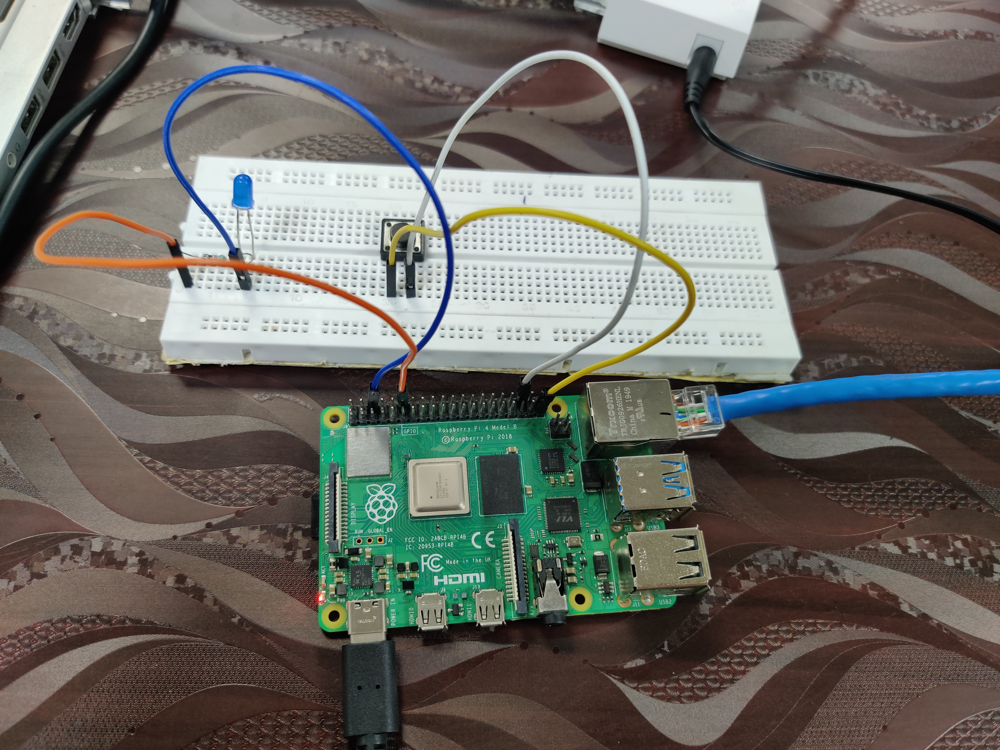
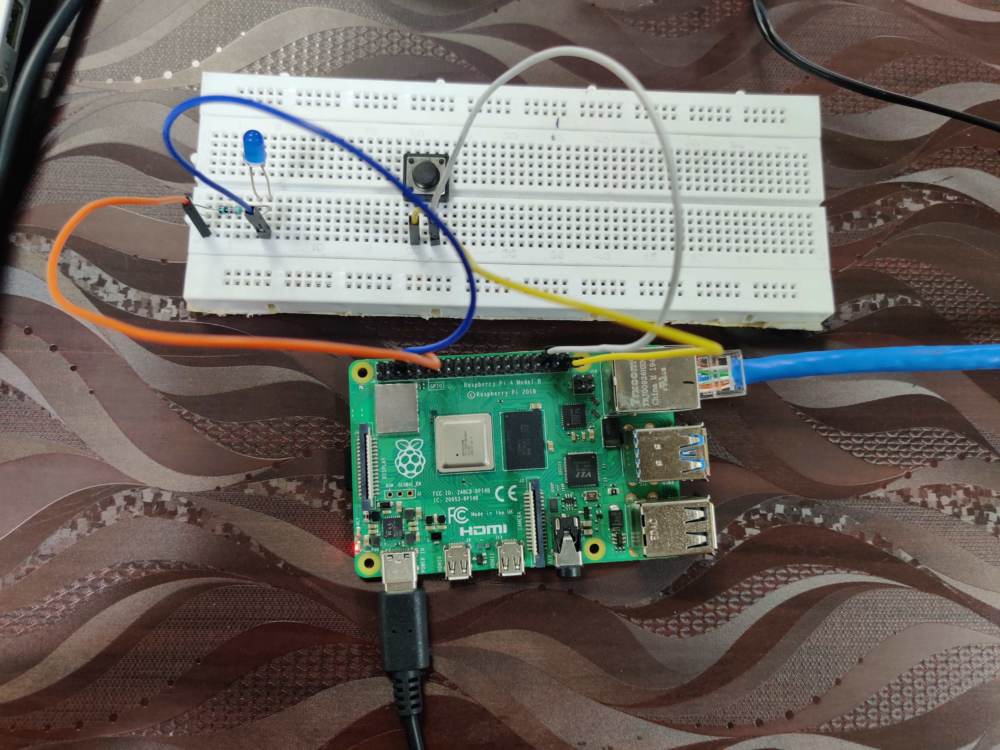

<!-- ABOUT THE PROJECT -->
## About The Project

This is a base project to exapnd on for a chemical lab digital twin. 

It contains an executale Unreal Engine file containg an LED that acts like a client and the virtual of the physical LED connected to a Raspberry Pi. Both the exe file and the Raspberry pi connect to a Websocket Server whicch acts as the main source of truth

### Built With

DEPENDENCIES:

* Nodejs Websocket Server
    * Nodejs 
* Rest API 
    * flask 
    * flask_restful
    * websocket
    * websocket-client
    * requests 
* Raspberry Pi
    * flask 
    * flask_restful
    * websocket
    * websocket-client

<!-- GETTING STARTED -->
## Getting Started

* Step 1: Websocket Server
    * Open the terminal and navaigate to the directory the websocket server is saved in. 
    * Run the server by typing node server and pressing enter. 
    * Your server will say that it is running.

* Step 2: UE Executable
    * Navigate to the executable file (.exe). 
    * Open it up. 

* Step 3: Rest API 
    * Save and run the Rest_client.py file. 
    * Make sure you have all the libraries installed 

* Step 4: Raspberry Pi 
    * Requirements:
        * LED 
        * 1k ohm resistor 
        * Push Switch 
        * 4 wires 
    * Connect the Raspberry pi as shown in the pictures below
    
        

        
        
    * Save the Raspberry Pi folder onto your Raspberry Pi. 
    * Make sure to pip install all the libraries. 
    * Open the Raspberry Pi Client file and change the BASE variable to the IP address that the websocket server is working on.
    Save and run it. 
